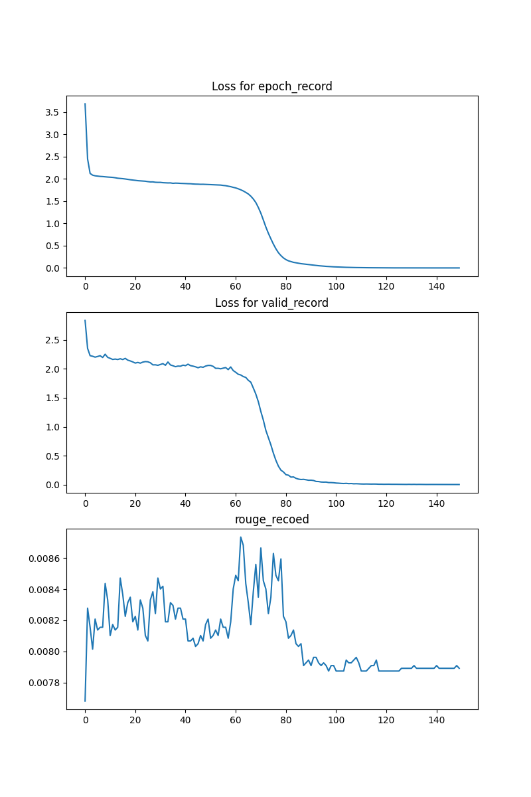
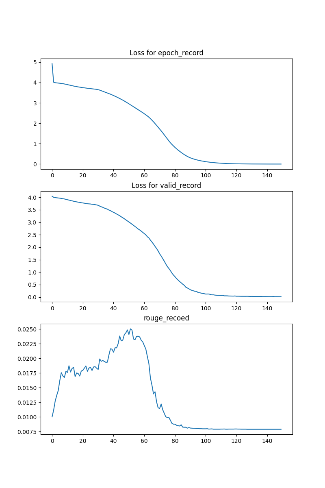
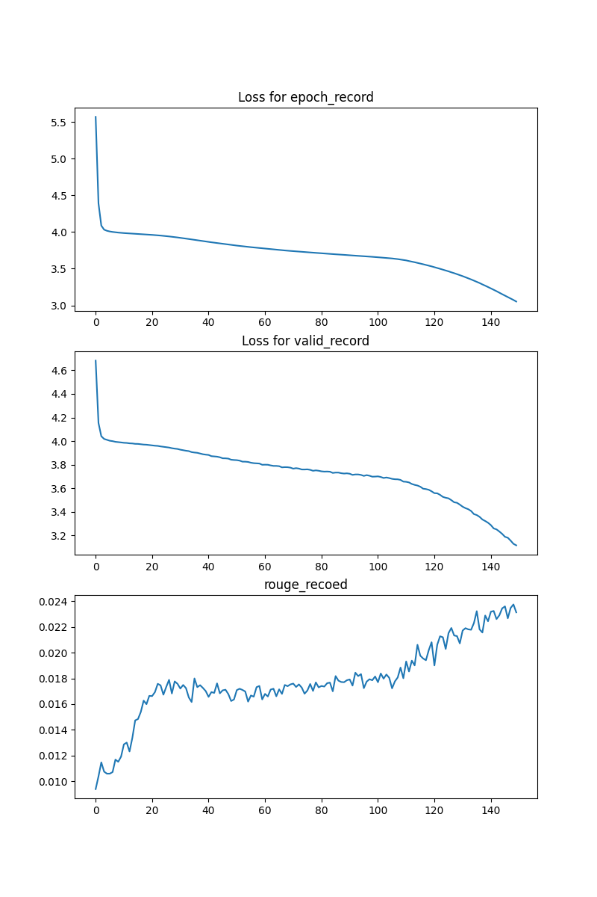

### 调参记录

首先是没有在交叉熵损失函数里面增加 `ignore_index=tokenizer.padding_index` : 损失函数有两次下降很快, 但是表现很差, 可能就是恒定学习率下梯度爆炸和梯度消失。

然后在交叉熵损失函数里面加了 `ignore_index=tokenizer.padding_index` : 因为句子中存在很多部分的 padding , 因此想着参与训练的效果可能不好。增加了之后, 损失函数仍然下降, 但是, 仍然存在梯度爆炸和梯度消失; 比较好的是测试的效果表现好了 3 倍左右。

最后调整了学习率, 将学习率下降了一半: 整个 epoch 都在稳定下降, 且效果表现在稳定上升。感觉不会上升太久, 因为在训练后期有平缓上升的趋势。

